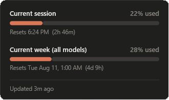

# ClaudeUsageTray

Your Claude session and weekly usage limits, in the Windows system tray.



Claude shows usage limits only inside the app (`/usage`) or on claude.ai. This puts them
one glance away: the session percentage is drawn into the tray icon itself, and clicking
it opens the popup above.

## Download

From the [latest release](https://github.com/jcyrio/ClaudeUsageTray/releases/latest), grab
the build for your machine and run it. Both are self-contained, so no .NET installation is
needed.

| File | For |
| --- | --- |
| `ClaudeUsageTray-win-x64.exe` | Intel / AMD PCs — almost everyone |
| `ClaudeUsageTray-win-arm64.exe` | ARM devices, e.g. Snapdragon-based Surface / Copilot+ PCs |

Not sure which? Check **Settings → System → About → System type**. The x64 build also runs
on ARM through emulation, just slower.

## How it works

It reads the rolling usage history the Claude desktop app already maintains — sampled
roughly every five minutes and kept for about two weeks. No API key, no token, no network
calls.

That file lives in one of two places, and the app checks both:

| Claude install | Path |
| --- | --- |
| Store / MSIX | `%LOCALAPPDATA%\Packages\Claude_*\LocalCache\Roaming\Claude\plan-usage-history.json` |
| Plain | `%APPDATA%\Claude\plan-usage-history.json` |

The Store build is an MSIX package, and MSIX redirects a packaged app's `%APPDATA%` writes
into its own `LocalCache`. So the obvious `%APPDATA%\Claude` path does not exist at all on
most machines — checking only there is why versions before v1.0.2 reported "no data".

## Requirements

- Windows 10 or 11
- The Claude desktop app, installed and signed in

## Usage

Run `ClaudeUsageTray.exe`. Left-click the tray icon to toggle the popup; right-click for
Refresh and Exit. Pass `--show` to open the popup immediately, which is handy if you want
to bind it to a shortcut key.

The tray number turns amber at 75% and red at 90%.

To start it with Windows, drop a shortcut in your Startup folder:

```powershell
$s=(New-Object -ComObject WScript.Shell).CreateShortcut((Join-Path ([Environment]::GetFolderPath('Startup')) 'ClaudeUsageTray.lnk')); $s.TargetPath='<full path to ClaudeUsageTray.exe>'; $s.Save()
```

## One thing to set

Weekly windows reset overnight, while the desktop app is closed and not sampling, so the
weekly reset time cannot be derived from the history file — and it differs per account.
Until you set it, the popup says `Reset time not set` rather than guessing.

Run `/usage` in Claude Code once, read off the weekly reset time, and write **any past
occurrence** of it to `%APPDATA%\ClaudeUsageTray\settings.json`:

```json
{ "weeklyAnchor": "2026-08-11T01:00:00" }
```

It rolls forward in seven-day steps from there, so you only do this once. The percentages
and the session reset need no configuration.

## Limitations

- Data can be **up to five minutes stale**, and stops updating entirely while the Claude
  desktop app is closed. The popup says so rather than showing frozen numbers as current.
- Session and all-model weekly only — the file holds no per-model breakdown.
- The file format is undocumented and has changed before (it is currently `version: 2`),
  so a Claude update could break this.

## Build

```
dotnet build -c Release
```

Requires the .NET 8 SDK.

## License

MIT
